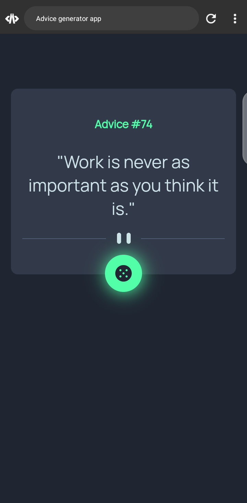

# Advice-generator-app

## Table of contents

- [Overview](#overview)
  - [The challenge](#the-challenge)
  - [Screenshot](#screenshot)
  - [Links](#links)
- [My process](#my-process)
  - [Built with](#built-with)
- [Author](#author)

### The challenge
The challenge was to build out an advice generator app using the [Advice Slip API](https://api.adviceslip.com)

Users should be able to:

- View the optimal layout for the app depending on their device's screen size
- See hover states for all interactive elements on the page
- Generate a new piece of advice by clicking the dice icon

### Screenshot

### Links

- Solution URL:(https://www.frontendmentor.io/solutions/advice-generator-app-77CzuuZWfl)
- Live Site URL:(https://lemon-stack.github.io/Advice-generator-app/)

### Built with

- Semantic HTML5 markup
- CSS custom properties
- Flexbox
- Mobile-first workflow

## Author

- Frontend Mentor - [@Lemon-stack](https://www.frontendmentor.io/profile/Lemon-stack)
- Twitter - [@lemonconfidence](https://x.com/lemonconfidence?t=b7UfmUeVnteyzfaVUt7y6g&s=08)
